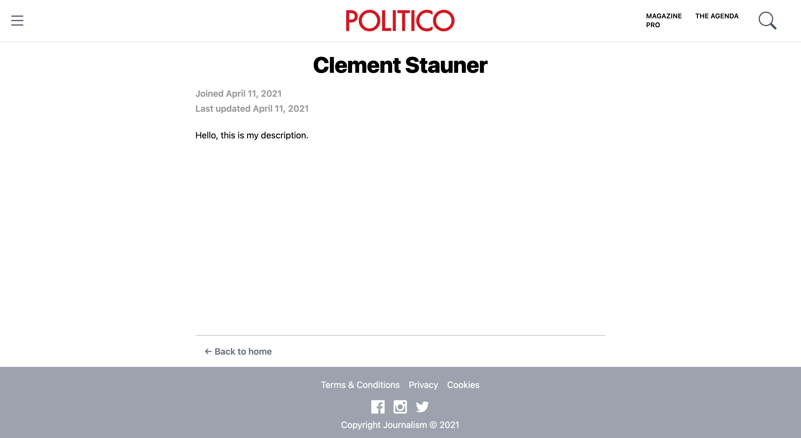

# Journalism

## Table of contents

1. [Visuals](#Visuals)
2. [Installation](#Installation)
3. [Usage](#Usage)
4. [TO-DO](#TO-DO)
5. [Contributing](#Contributing)
6. [Authors and acknowledgment](#Authors-and-acknowledgment)
7. [License](#License)

## Visuals

### Project Architecture


### Screenshots

#### UI


#### Server




### Micro-services

There are 5 containers running on the Docker cluster:

1. Postgres database
2. PgAdmin4 Web server for postgres administration
3. The DAO (Data Access Object), API to interact with the database
4. The the Next.js server (Node.js) rendering UI for the readers
5. Nginx web server used to host the Journalist Web App (Portal) and do reverse proxy.

#### Database

The database is PostgresQL running on port 5432.\
There are 3 tables:

- users: to store user information (id, name, url, description, email, password, created_at, updated_at)
- jwt: (id, user_id, token, created_at, updated_at)
- articles (id, user_id, title, content, is_completed, created_at, updated_at)

The database parameters and scripts are located in ./postgres.

#### PgAdmin

The PgAdmin4 web server is running on port 5050.

PgAdmin is the most popular and feature rich Open Source administration and development platform for PostgreSQL, the most advanced Open Source database in the world.

#### Data Access Object

The DAO is running on post 81.

This is an [Node.js](https://nodejs.org/en/) API which makes the link between an app and a database.

In computer software, a [data access object (DAO)](https://en.wikipedia.org/wiki/Data_access_object) is a pattern that provides an abstract interface to some type of database or other persistence mechanism. By mapping application calls to the persistence layer, the DAO provides some specific data operations without exposing details of the database. This isolation supports the single responsibility principle. It separates what data access the application needs, in terms of domain-specific objects and data types (the public interface of the DAO), from how these needs can be satisfied with a specific DBMS, database schema, etc. (the implementation of the DAO).

The files are located in the folder ./dao.

#### Next.js

The container is running on port 3001. For development mode, it is running on port 3000.

Next.js is an open-source React front-end development web framework that enables functionality such as server-side rendering and generating static websites for React based web applications. It is a production-ready framework that allows developers to quickly create static and dynamic JAMstack websites and is used widely by many large companies. Next.js is one of several recommended "toolchains" available when starting a new React app, all of which provide a layer of abstraction to aid in common tasks. Traditional React apps render all their content in the client-side browser, Next.js is used to extend this functionality to include applications rendered on the server side.

The files are located in the folder ./server.

#### Nginx

The container listens on port 8080 and send the compiled React.js App (UI).

It serves as a reverse proxy for the Next.js server. It listens on port 80 and redirects the traffic to port 3001. That means a user connects to port 80, it will be the same as connecting to port 3001.

Nginx (pronounced "engine X") is a web server that can also be used as a reverse proxy, load balancer, mail proxy and HTTP cache.

### Folders

- ./dao: Data Access Object (Node.js API).
- ./docker: docker-compose files for development/test mode.
- ./docs: Project documentation (images, screenshots, PowerPoint).
- ./nginx: Nginx Web Server config files + compiled React.js Web App.
- ./postgres: Database config and SQL files.
- ./scripts: Bash scripts for continuous integration & continuous development (CI-CD) automation.
- ./server: Next.js server.
- ./tests: Postman config file.
- ./ui React.js Web App for user interface.

## Installation

To install the project first download [Docker Desktop](https://www.docker.com/products/docker-desktop). \
Docker Desktop is an application for MacOS and Windows machines for the building and sharing of containerized applications and micro-services.

### Start

```bash
docker-compose up
```

### Stop

```bash
docker-compose down
```

### Build

```bash
docker-compose build
```

Note: "docker-compose up --build" automatically builds/rebuilds the project

## Usage

Open your web browser @ <http://localhost:80/>

## TO-DO

### Server Next.js

- Page: 404
- Page: Post
- Page: Author

### React.js UI

- User: update

### Nginx Web server

- DAO Reverse Proxy using subdomain
- Subdomain for React.js compiled WebApp

### Docs

- Word
- README: installation + usage

## Contributing

Pull requests are welcome. For major changes, please open an issue first to discuss what you would like to change.

Please make sure to update tests as appropriate.

## Authors and acknowledgment

Made by Clément Stauner, 2020.

## License

[© Apache 2.0](https://www.apache.org/licenses/LICENSE-2.0.html)
