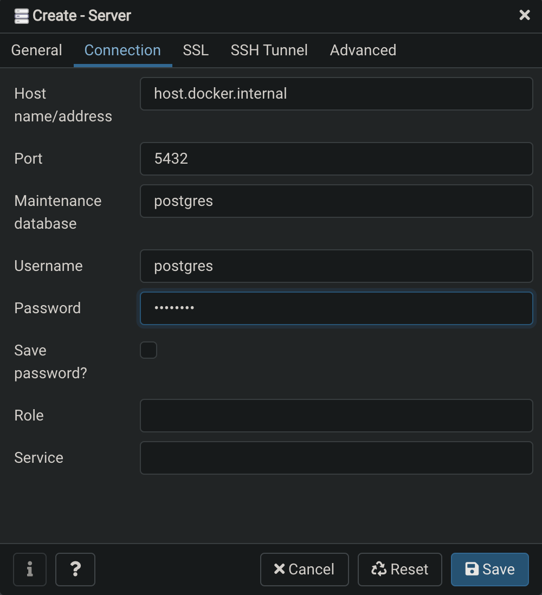

# PostgreSQL (Database)

PostgreSQL also known as Postgres, is a free and open-source relational database management system (RDBMS) emphasizing extensibility and SQL compliance.

The DAO access the database to create, read, update and delete data (CRUD).

## Table of contents

1. [Project architecture](#Project-architecture)
2. [Installation](#Installation)
3. [Usage](#Usage)
4. [Contributing](#Contributing)
5. [Authors and acknowledgment](#Authors-and-acknowledgment)
6. [License](#License)

## Project architecture

## Installation

### Dockerfile

The installation is done with docker-compose command in root directory. \
The Dockerfile creates a Docker container with a PostgreSQL database. \
Write your SQL code and save it in /postgres/sql/. \
It will copy/paste the SQL code in the Docker container @ /docker-entrypoint-initdb.d/. \
On build, it will create the tables necessary for the proper functioning of the cluster.

### SQL Code

The SQL code is executed in the order of the file names. \
That means if you have a SQL code B that needs to executed before another one A, you have to rename the files accordingly so that B's name is before A's name in alphabetical order.

For instance, I have two SQL files (A) and (B) :

- (A) create_table_articles.sql
- (B) create_table_users.sql

I need to execute (B) before (A) because (A) contains of foreign key referencing a row in (A). \
Otherwise I will get an error while building the postgres Docker container.

So, the new file names will be :

- 1_create_table_users.sql
- 2_create_table_articles.sql

## Usage

Connect to database using PgAdmin4 frontend. \
Open your web browser @ <http://localhost:5050/> \
host: host.docker.internal

## Contributing

Pull requests are welcome. For major changes, please open an issue first to discuss what you would like to change.

Please make sure to update tests as appropriate.

## Authors and acknowledgment

Made by Clément STAUNER January 2021.

## License

[© Apache 2.0](https://www.apache.org/licenses/LICENSE-2.0.html)
